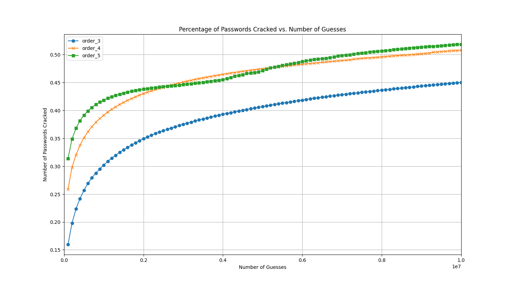

# 算法复现

## 复现设置

- **数据集**: Rockyou 3200w样本
  - 训练集: 1M
  - 测试集: 10M

- **Markov模型**
  - End-Symbol + Laplace-Smoothing（参数0.01）
  - 迭代计算结构如下:

```python
# 以起始字符初始化iter_set
iter_set = []
while True:
    # 生成下一层密码
    next_password = i + nextchar

    # 检查新生成密码是否符合概率阈值
    if 新生成密码的概率 > 概率阈值:
        # 将新生成的密码作为下一次迭代的起始密码
        iter_set.append(next_password)

    # 检查密码加上结束符号的概率
    if next_password*(nextchar = endsymbol 的概率) > 概率阈值:
        # 如果满足条件，则保存该密码
        save(next_password)
```

## 复现用时 & 内存使用

- 各部分运行时长控制在合理范围内，整体运行速度较快。
生成4阶模型下3000w密码速度在40min左右，模型阶数增大会小幅提高生成时间。其余部分（密码匹配、做图）耗时一分钟内
- 与PCFG的比较:
  在密码匹配阶段（生成密码与目标测试集），使用字典存储目标测试集中的密码及其出现次数。
  对于生成的密码，作为字典的键，将字典中的对应值累加。
  与遍历数组查找匹配数的方法相比，提速明显。
- 随着模型阶数的上升，从训练集中学习的概率模型占用内容会大幅增长，在5阶模型下就有内存溢出的风险。使用李臻学长推荐的方法，不存储概率的计算结果，显著降低内存占用至原来的1/4

## 结果分析

- 
- **匹配率分析**:
  - 与原论文基本一致

## 相较于第一版改进
- 第一版错误将build_markov_model方法调用了两次，导致计算与实际概率出现偏差，由李臻学长指出后改进